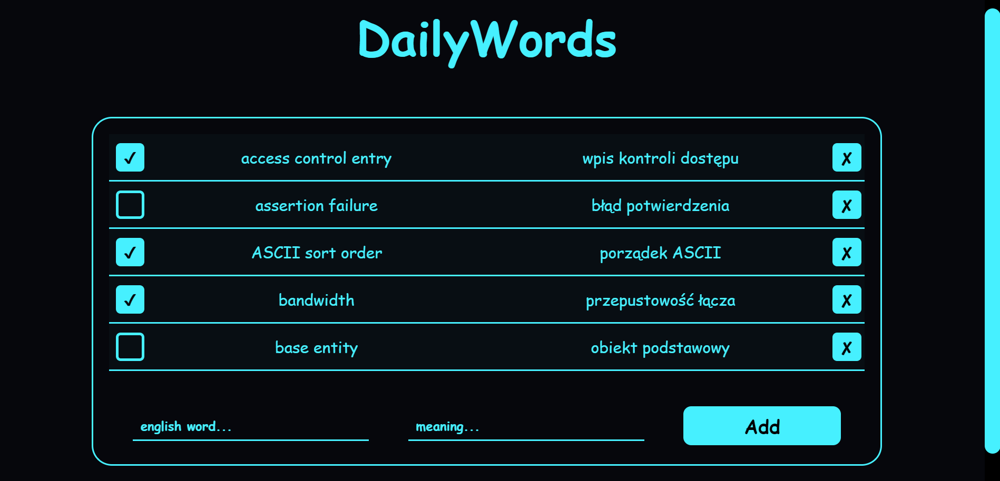

# DailyWords



## Live

<https://maciejspalek.github.io/DailyWords/>

 ## About the project
The application for saving words and their meanings. Thanks to localStorage, words are saved in browser’s memory.

## Tech/framework used
 * HTML
 * CSS + SASS
 * JS + jQuery
 * Responsive Web Design
 * Local Storage

## Usage

```
git clone https://github.com/MaciejSpalek/DailyWords.git

npm install

npm start
```
